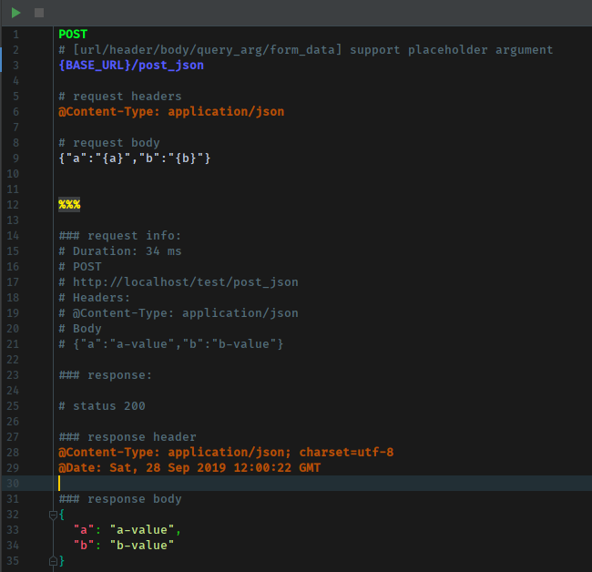
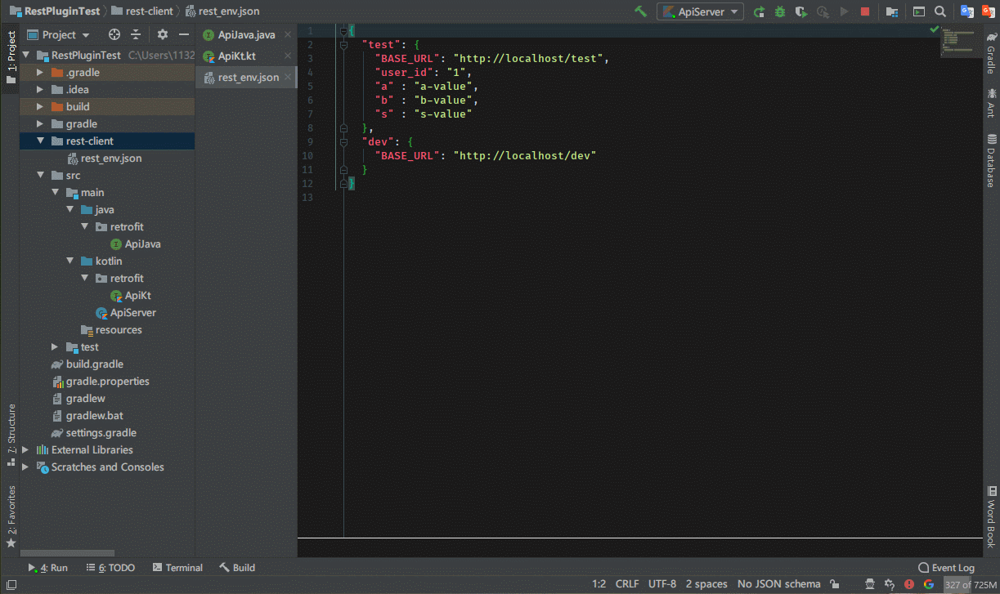
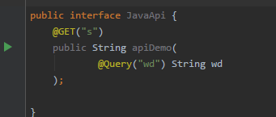
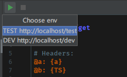

[](https://plugins.jetbrains.com/plugin/13075-retrofit-rest-client-2-0/)

# Retrofit Rest Client


> The best http client for Android Studio.
>
> This plugin is based on [idea-rest-client](https://github.com/danblack/idea-rest-client).


> - **Support run retrofit api interface functions directly.**
> - Supports GET, POST, PUT, DELETE, PATCH requests
> - Multiline request parameters
> - Rest file type support
> - Internally supported dynamic parameters
> - Response auto format (based on response Content-Type header)
> - Customized colors and fonts
> - Customized keyboard shortcuts
> - Comments
> - Support large body download
> - Support un-text download and preview


- [PreView](#PreView)
- [Demo](#Demo)
- [Retrofit Guide](#retrofit-guide)
- [Set env params](#set-env-params)
- [Install](#install)
- [Advanced](#advanced)
- [Thanks](#thanks)


**使用方法：**    
**1. 新建 `xxx.rest` 格式文件，按照 Preview 编辑即可**  
**2. 直接在 Retrofit Api 函数左侧 `Run` 即可**

**How to use：**    
**1. New a `xxx.rest` file，and edit like preview**  
**2. Click the `Run` icon which left in `Retrofit Api` function**

### Preview

- Rest file

You can create `rest` file to edit.

Content structure



- Gif

Run retrofit api method



### Demo

- GET

```rest
GET
{BASE_URL}/get
# query params
&id=1
&type=2

# headers
@Content-Type: application/json
@timestamp: {TS_SEC} # current time in seconds
```

- POST

  - Json

  Apponit content-type: `@Content-Type: application/json`
  ```rest
  POST
  {BASE_URL}/post_json
  
  # request headers
  @Content-Type: application/json
  
  # request body
  {"a":"{a}","b":"{b}"}
  ```

  - Form

  Apponit content-type: `@Content-Type: application/x-www-form-urlencoded`, and last line is form data(can be multiple line)

  ```rest
  POST
  {BASE_URL}/post_form/{user_id}
  
  # Headers:
  @Content-Type: application/x-www-form-urlencoded
  
  # Form data separate with '&'
  id=1&s=hello
  
  # also can be:
  &id=1
  &s=hello
  ```

### Retrofit Guide

We can find `execute icon` on api method:



click the icon will create a rest file in `{PROJECT_DIR}/.idea/rest-client/pkg/cls_fun.rest`

```rest
GET
{BASE_URL}/abc
&q={q}

# Headers
@a: {a}
```

don't forget [Set env params](#set-env-params)


### Set env params

You can use `{name}` to reference env variable.

1. To create json file `{PROJECT_DIR}/.idea/rest-client/rest_env.json`(`Auto create`)

```json5
{
  "test": {
    "BASE_URL": "http://localhost:8080",
    //common headers
    "headers": {
      "Content-Type": "application/json",
      "timestamp": "{TS}"
    },
    "user_id": "1",
    "a" : "a",
    "b" : "b"
  },
  "dev": {
    "BASE_URL": "http://xxx.xxxx.xxx"
  }
}
```

2. Choose env to tun



### Install

1. Marketplace

IDEA or Android Studio `Settings/Plugins/Marketplace` search `Retrofit Rest Client`

2. download [retrofit-rest-client.zip](https://github.com/Vove7/retrofit-rest-client/blob/master/retrofit-rest-client.zip) file.

`Settings/Plugins/` Install Plugin from Disk.

### Advanced

- internal support placeholder

`{TS}`

```
GET
http://xx.xx.xx/api
@timestamp: {TS}   # current time in milliseconds
@timestamp_sec: {TS_SEC}   # current time in seconds
@timestamp_custom: {TS_yyyy-MM-dd#HH:mm:ss}   # current time custom format with SimpleDateFormat (use '#' instead of ' ')

```


### Thanks

This plugin is based on [idea-rest-client](https://github.com/danblack/idea-rest-client).

### TODO


- Multiple requests in one file. [like http client]

- Response result output tu run window.  [like http client]

